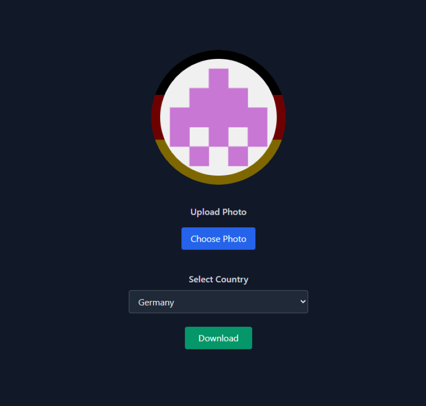
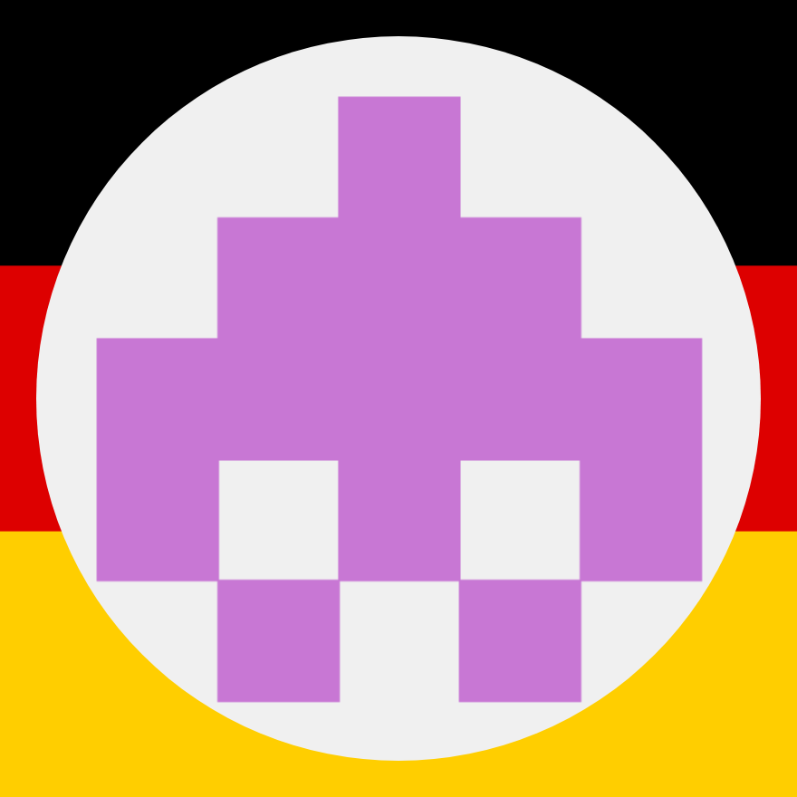

# Flag Overlay Profile Picture Generator

Easily create a profile picture with your country flag overlay! 🌍✨

## Features
- Upload your own photo
- Select a country flag to overlay
- Download your new profile picture

## How to Use
1. **Upload Photo**: Click the "Choose Photo" button and select your image.
2. **Select Country**: Pick a country from the dropdown menu.
3. **Download**: Click the "Download" button to save your new profile picture.

## Example

| Website Pic | With Flag Overlay |
|:--------------:|:----------------:|
|  |  |

> _Note: Example images are included in this repository._

## Supported Flags
🇺🇸 🇬🇧 🇨🇦 🇦🇺 🇮🇹 🇮🇱 🇹🇷 🇵🇸 🇩🇪 🇫🇷 🇯🇵 🇨🇳 🇧🇷 🇮🇳 🇷🇺

## Tech Stack
- HTML, CSS (TailwindCSS)
- JavaScript

## Used API
This project uses the [FlagCDN API](https://flagcdn.com/) to fetch country flags.

## Project Link
[Flag Overlay Profile Picture Generator](https://pp-flag-border-website.onrender.com/)

## License
MIT
